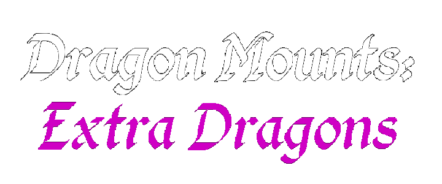

# [Dragon Mounts: Extra Dragons Bedrock](https://www.curseforge.com/minecraft-bedrock/addons/dragon-mounts-v1-3-25)

Also known as "Dragon Mounts: Community Edition", it is an extension add-on based on Dragon Mounts 2 which adds extra dragons that don't fit with the base add-on. Nevertheless, you can choose which dragons you want without conflicting with Dragon Mounts 2!

## License
The add-ons binaries, as well as its textures and code are licensed under the GPLv3 
license.

- You CAN modify, copy and distribute this add-on.
- You CAN use it privately or for commercial use.
- You CAN'T change the license of your modified version.
- You CAN'T make the modified source code closed.
- You HAVE TO indicate any changes in the modified version.

## Credits

- Grummboy2 - Project Owner & Developer
- Tomanex - Dragon Mounts 2 Owner
- JDSKoala - Dragon Mounts 2 Co-Owner
- Mrngda - Lead Coder
- Eclipsed Light - Artist
- EquinoxtheWingedWolf - Artist 
